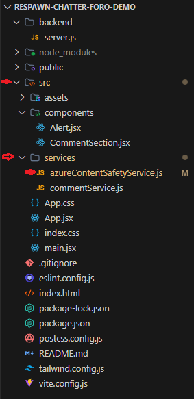

# Integración con APIs de Terceros

## 1. Introducción

En el desarrollo de software moderno, la interacción entre aplicaciones se ha convertido en una práctica común y fundamental para crear soluciones eficientes y escalables.

Las APIs de terceros son aquellas que son proporcionadas por empresas externas, permitiendo que otros desarrolladores y organizaciones puedan integrar funcionalidades avanzadas en sus propias aplicaciones. Estas APIs abarcan una amplia gama de servicios, desde pagos en línea y almacenamiento en la nube, hasta la moderación de contenido y procesamiento de lenguaje natural. A través de la integración de APIs de terceros, los desarrolladores pueden acceder a soluciones especializadas sin tener que desarrollarlas desde cero, lo que acelera el ciclo de desarrollo y mejora la calidad de las aplicaciones.

En este informe, exploraremos los conceptos fundamentales detrás de las APIs de terceros, las ventajas y desafíos asociados con su integración, y proporcionaremos un análisis técnico sobre cómo implementar una API de moderación de contenido, enfocándonos en un entorno de desarrollo con Node.js.

## 2. Desarrollo Conceptual

Las APIs actuan como intermediarios que facilitan la comunicación entre diferentes sistemas, permitiendo que aplicaciones externas interactuen entre sí mediante el consumo de servicios o obteniendo datos de algún proveedor de API. Existen diferentes tipos de APIs para exponer o consumir, entre ellos tenemos los siguientes.

- **Tipos de APIs**:
  - *RESTful APIs*: Estas APIs, basadas en arquitectura REST, aprovechan los métodos HTTP (GET, POST, PUT, PATCH, DELETE) para interactuar con los datos. Generalmente devuelven los datos en JSON, pero también permite XML, HTML, texto plano y otros formatos.
  
  - *GraphQL APIs*: Brindan a los usuarios la capacidad de solicitar los datos de forma precisa. Se utiliza un lenguaje de consulta, permitiendo definir con exactitud qué datos se quieren obtener.
  
  - *SOAP APIs*: Se basan en el protocolo SOAP y utilizan XML para el intercambio de mensajes, ofrece un enfoque estructurado para la comunicación de sistemas.
  
## 3. Beneficios y Desafíos

- **Beneficios de la Integración**:
  - Reducción significativa del tiempo de desarrollo al aprovechar funcionalidades ya existentes.
  - Permite a los equipos de desarrollo centrarse en las características únicas de su aplicación.
  - Utilización de servicios probados y optimizados, lo que puede resultar en un mejor rendimiento y fiabilidad.
  - Capacidad de adaptar y escalar servicios según las necesidades cambiantes del negocio.
  - Ahorro en costos de desarrollo, mantenimiento y operación de servicios complejos.

- **Desafíos**:
  - Riesgo de interrupciones del servicio debido a problemas en los sistemas del proveedor de la API.
  - Necesidad de implementar estrategias de manejo de fallos y planes de contingencia.
  - Restricciones en el número de llamadas a la API, lo que puede limitar la funcionalidad o escalabilidad.
  - Riesgo de que cambios en la API del tercero afecten el funcionamiento de la aplicación.
  - Posible aumento en los tiempos de respuesta debido a la comunicación con servicios externos.

## 4. Consideraciones Técnicas

### 4.1 Instalación y configuración del proyecto frontend

Para iniciar el desarrollo del módulo de foro, hemos elegido utilizar React como tecnología principal para el frontend, debido a su capacidad para construir interfaces de usuario dinámicas y reactivas. La instalación y configuración del proyecto se realizó siguiendo los siguientes pasos:

#### 4.1.1. **Crear un nuevo proyecto con Vite**:

  Nos ubicamos en la carpeta donde tenemos el frontend, usaremos vite para el demo :
  
  ```bash
  npm create vite@latest . 
  ```
  Seleccionamos la opción de react y javascript. Posteriormente, instalamos las dependecias front del proyecto

  ```bash
  npm install 
  ```

  Nos ubicamos en `vite.config.js` y cambiamos el puerto default del proyecto por uno personalizado agregando esto debajo de `plugins`

  ```js
  server: {
    port: 3000
  }
  ```

#### 4.1.2 **Instalamos tailwind y daisy UI**: 

  Usaremos los siguiente: 

  ```bash
  npm install -D tailwindcss postcss autoprefixer
  npx tailwindcss init -p
  ```

    Reemplazamos el contenido de `tailwind.config.js` por lo siguiente: 
  ```js
  /** @type {import('tailwindcss').Config} */
  export default {
    content: [
      "./index.html",
      "./src/**/*.{js,ts,jsx,tsx}",
    ],
    theme: {
      extend: {},
    },
    plugins: [],
  }
  ```

  actualizamos el index.css ubicado en .src/ con este contenido: 
  
  ```js
  @tailwind base;
  @tailwind components;
  @tailwind utilities;
  ```

  Instalamos daysi UI para usar sus componentes

  ```bash
  npm i -D daisyui@latest
  ```

  Agregamos daisyUI a la configuración en `tailwind.config.js`, importando daisyUI y lo agregamos en `plugins`: 

  ```js
  import daisyui from 'daisyui'

  export default {
  content: [
    "./index.html",
    "./src/**/*.{js,ts,jsx,tsx}",
  ],
  theme: {
    extend: {},
  },
  plugins: [daisyui],
  }
  ```

### 4.2 Configuración para probar el demo en local

#### 4.2.1 **Clonación del proyecto**

 Para ejecutar el demo en local, primero clonamos el repositorio del proyecto con el siguiente comando: 

 ```bash
 git clone https://github.com/Joselinares17/respawn-chatter-foro-demo.git
 ```

 Después de clonar el proyecto, accedemos al directorio del mismo:

 ```bash
 cd respawn-chatter-foro-demo
 ```

 #### 4.2.2 **Instalación de dependencias**

 Una vez dentro del proyecto, instalamos todas las dependencias necesarios ejecutando: 

 ```bash
 npm install
 ```

 las dependencias que se instalan y demás configuraciones se puede encontrar en `package.json`: 

 ```json
 {
  "name": "respawn-chatter-foro-demo",
  "private": true,
  "version": "0.0.0",
  "type": "module",
  "scripts": {
    "dev": "vite",
    "server": "node backend/server.js",
    "build": "vite build",
    "lint": "eslint .",
    "preview": "vite preview"
  },
  "dependencies": {
    "@azure-rest/ai-content-safety": "^1.0.0",
    "axios": "^1.7.7",
    "cors": "^2.8.5",
    "dotenv": "^16.4.5",
    "express": "^4.21.1",
    "react": "^18.3.1",
    "react-dom": "^18.3.1",
    "react-icons": "^5.3.0",
    "react-router-dom": "^6.26.2"
  },
  "devDependencies": {
    "@eslint/js": "^9.11.1",
    "@types/react": "^18.3.10",
    "@types/react-dom": "^18.3.0",
    "@vitejs/plugin-react": "^4.3.2",
    "autoprefixer": "^10.4.20",
    "concurrently": "^9.0.1",
    "daisyui": "^4.12.12",
    "eslint": "^9.11.1",
    "eslint-plugin-react": "^7.37.0",
    "eslint-plugin-react-hooks": "^5.1.0-rc.0",
    "eslint-plugin-react-refresh": "^0.4.12",
    "globals": "^15.9.0",
    "nodemon": "^3.1.7",
    "postcss": "^8.4.47",
    "tailwindcss": "^3.4.13",
    "vite": "^5.4.8"
  }
}
 ```

#### 4.2.3 **Comandos para iniciar el frontend y backend**

  El comando para ejecutar el frontend es: 

  ```bash
  npm run dev
  ```

  Y para ejecutar el backend es: 

  ```bash
  npm run server
  ```

#### 4.2.4 **Creación del recurso de Azure y configuración en local**
  Una vez iniciado sesión en Azure nos dirigimos `create a resource`, en el buscador ponemos "AI", te redirigirá a un menú y seleccionas la opción "Azure service only" te saldrá la siguiente página:

  

  Una vez hayas seleccionado la opción de `Create`, completamos los datos que nos indican y le damos a `Review + create`: 

  

  Creamos el recurso dandole a `Create`

  

  Esperamos a que el recurso termine de desplegar para despues seleccionar `Go to resource`:

  

  Te diriges al menu en `Resource Management` -> `Keys and Endpoint`, podrás visualizar las llaves y el endpoint para las solicitudes REST. Para el demo solo necesitas una llave y el endpoint. 

  

  En el caso de la demo, esos datos se hardcodean en `azureContentSafetyService.js`, se encuentra en: 

  

  Y las constantes asignadas en ese archivo son: `API_KEY` y `ENDPOINT`. Como se muestra a continuación:

  ```js
  const API_KEY = <REEMPLAZAR_KEY>;
  const ENDPOINT = <REEMPLAZAR_ENDPOINT>;
  ```

  Finalmente, al final del archivo deber asignarle esas constantes en los parámetros a la instancia que se está exportando de la clase `azureContentSafetyService`, de la siguiente manera: 

  ```js
  export default new AzureContentSafetyService(ENDPOINT, API_KEY);
  ```

  Con esto es suficiente para probar el demo localmente con tu propio recurso de Azure.

## 5. Referencias

  - Admin. (2019, 24 febrero). Consumir una API utilizando JavaScript | Manticore Labs ec -  Desarrollo Web y Móvil en el Ecuador. https://manticore-labs.com/2019/02/24/consumir-una-api-utilizando-javascript/
  - De Souza, I. (2021, 12 febrero). API rest: conoce la importancia de ese recurso para el desempeño de una página web. Rock Content - ES. https://rockcontent.com/es/blog/api-rest/
  - Fuster, G. (2022, 18 abril). Tutorial de Fetch API en JavaScript con ejemplos de JS Fetch, Post y Header. freeCodeCamp.org. https://www.freecodecamp.org/espanol/news/tutorial-de-fetch-api-en-javascript-con-ejemplos-de-js-fetch-post-y-header/
  - PatrickFarley. (2024, 3 septiembre). Inicio rápido: análisis del contenido del texto - Azure AI services. Microsoft Learn. https://learn.microsoft.com/es-es/azure/ai-services/content-safety/quickstart-text?tabs=visual-studio%2Cwindows&pivots=programming-language-rest
  - Skyone. (2024, 9 octubre). Tipos de API: Entenda as Diferenças e Aplicações. Skyone. https://skyone.solutions/es/blog/tipos-de-api/
  - Third-party APIs - Learn web development | MDN. (2024, 23 septiembre). MDN Web Docs. https://developer.mozilla.org/en-US/docs/Learn/JavaScript/Client-side_web_APIs/Third_party_APIs
